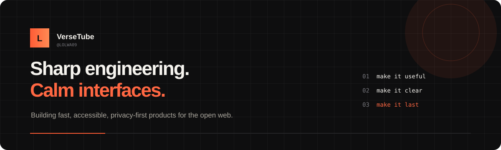
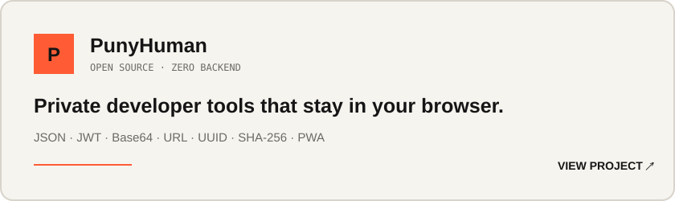

<div align="center">
  
</div>

<br />

### I build web products that earn their place on a user's screen.

My work sits where **product thinking**, **frontend engineering**, and **open-source craft** meet. I care about fast interfaces, strong defaults, accessible interactions, boring reliability, and code another developer can confidently change six months later.

<table>
<tr>
<td width="33%" valign="top">

**01 · Product**

Start with the problem. Remove friction before adding features.

</td>
<td width="33%" valign="top">

**02 · Engineering**

Small modules, explicit trade-offs, tests where failure matters.

</td>
<td width="33%" valign="top">

**03 · Interface**

Accessible, responsive, keyboard-friendly, and intentionally quiet.

</td>
</tr>
</table>

## Selected work

<a href="https://github.com/LOLWA09/PunyHuman">
  
</a>

**PunyHuman** is a zero-backend developer toolbox for formatting, inspecting, and generating data without sending it to a server. It is framework-free, installable as a PWA, tested with Node's native test runner, and deployed through GitHub Actions.

[Explore the repository →](https://github.com/LOLWA09/PunyHuman)

## Engineering values

```text
Performance is a feature.        Accessibility is a requirement.
Privacy is an architecture.      Simplicity is earned, not assumed.
Documentation is part of code.   Maintenance is part of design.
```

## Current focus

- Shipping **PunyHuman** and expanding its local-first toolset
- Deepening frontend architecture, browser APIs, and performance work
- Contributing small, reviewable improvements to open-source projects

## Toolbox

`JavaScript` · `TypeScript` · `HTML` · `CSS` · `Node.js` · `Git` · `GitHub Actions` · `PWA` · `Web APIs` · `Accessibility`

## Let's build something useful

I am interested in thoughtful open-source collaboration, developer tooling, and web products with strong UX. Open an issue on one of my repositories or start a discussion through GitHub.

<div align="center">
  <sub>Less noise. Better software.</sub>
</div>
